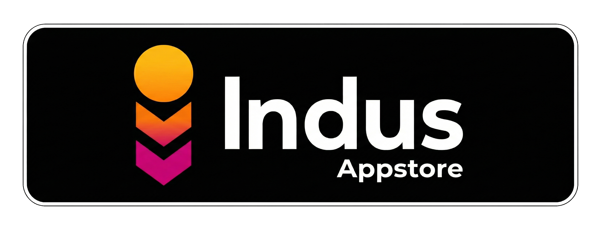

  

<h1 align="center">Thor App Manager</h1>

  
  &nbsp;
  
  &nbsp;
  

  <a href="https://t.me/thorAppDev">Telegram Channel</a>

---

* Kotlin + Material 3 Design
* Jetpack Compose
* Room DB App Caching
* Custom Hidden API Bypass
* PlayStore Download Size (around 2.0 MB)
* Smallest APK size (less than 4 MB)
* FOSS - GPL-3.0
* Fully Offline
* No Ads/Trackers

## Working Features

- High-performance app list loading with Room DB metadata caching
- Fingerprint Lock
- Themes (dark, light, system) + AMOLED + Asgardian static theme
- **Redesigned App Installer** — install packages with root, shizuku, or normal, featuring detailed UI states and associations for split formats (`.apkm`, `.apks`, and `.xapk`)
- **Universal Android Debloater (UAD) Integration** — safety recommendation chips (Recommended, Advanced, Expert, Unsafe) dynamically shown for system packages
- **Safe System App Debloating & Freezing** — uninstalls system apps for the current user (`pm uninstall --user`) and restores them (`pm install-existing`) to support modern Android versions safely
- **Adaptive UI Layouts** — vertical navigation rail for tablets/foldables, optimized viewport layouts, and split landscape detail screens
- **Safety Gating** — blocks freezing of system apps marked as **Unsafe** by UAD to prevent bootloops, and warns on **Expert** packages
- Root Support
- Shizuku Support
- Dhizuku Support
- Fully reproducible, copyleft libre software (GPLv3.0)
- Material 3 with optional dynamic colors (Material You)
- Work Mode selection — manually choose between Root, Shizuku, or Dhizuku as the active privilege
  engine
- Displays App List while sorting them based on Installation source
- Search in App List and Freezer
- Multi-language support (English, Spanish, French, Arabic, Chinese) with in-app language switcher
- Launch App Activities
- Install/Uninstall/Freeze/Unfreeze Apk files
- Suspend/Unsuspend apps (shows custom Thor-branded system dialog)
- Background Restriction (restrict app background activity)
- Reinstall APKs/Fix Store installer record (available in all privilege modes)
- Share App Apk file
- Batch Reinstall/Uninstall/Freeze/Unfreeze/Kill/Suspend/Clear Data
- Split App Indicator
- AppState Indicator (frozen / suspended / hidden)
- Local icon caching and danger badges for user-uninstalled system apps
- Uninstall System Apps
- Freeze/UnFreeze System apps
- Sorting & filters
- Layout preference persistence (grid/list mode preserved across restarts)
- Clear Data/Cache (available in all privilege modes)

## Upcoming Features

- BackUp App Data
- Editing Packages.xml
- Batch Install
- Launcher-shortcut / deep-link triggering for automation extensions, via an authenticated handoff
  (explicit-component intent or nonce-signed token). The earlier public `thor://extension/trigger`
  deep link was removed because, being exported, any app could drive triggers through Thor's
  signature-level permission.
- Many more

## 💖 Support Development

Thor is a labor of love, built to be **100% offline, ad-free, and tracker-free**. If this tool has
made your Android management easier, consider supporting its continued development. Your
contributions help keep the project alive and free for everyone.

| Platform            | Link                                                        |
|---------------------|-------------------------------------------------------------|
| **Patreon**         | [Support on Patreon](https://www.patreon.com/trinadh)       |
| **Buy Me a Coffee** | [Buy me a coffee](https://www.buymeacoffee.com/trinadh)     |
| **PayPal**          | [Donate via PayPal](https://www.paypal.me/trinadhthatakula) |

## Credits

- Portions of this app use code from [`libsu`](https://github.com/topjohnwu/libsu)
  by [topjohnwu](https://github.com/topjohnwu/), adapted and integrated as the [
  `suCore`](https://github.com/trinadhthatakula/Thor/tree/master/suCore) module.
- Replaced [`AndroidHiddenApiBypass`](https://github.com/LSPosed/AndroidHiddenApiBypass) with an
  internal Kotlin implementation in the [
  `bypass`](https://github.com/trinadhthatakula/Thor/tree/master/bypass) module, backed by Java
  stubs in the [`vm-runtime`](https://github.com/trinadhthatakula/Thor/tree/master/vm-runtime)
  module for maximum compatibility when shadowing system classes.

### Modifications to libsu

- Fully converted the original Java-based `libsu` code to Kotlin for `suCore`
- Refer SuCore [README](https://github.com/trinadhthatakula/Thor/blob/master/suCore/README.md) for
  more details

## License

This project is licensed under the GNU General Public License v3.0 (GPL-3.0).

- `libsu` is licensed under the Apache License 2.0. All modifications and usage in this project
  comply with the Apache-2.0 requirements.
- This project as a whole is distributed under the GNU General Public License v3.0 (GPL-3.0).
- See the [LICENSE](LICENSE) file for full license text.
