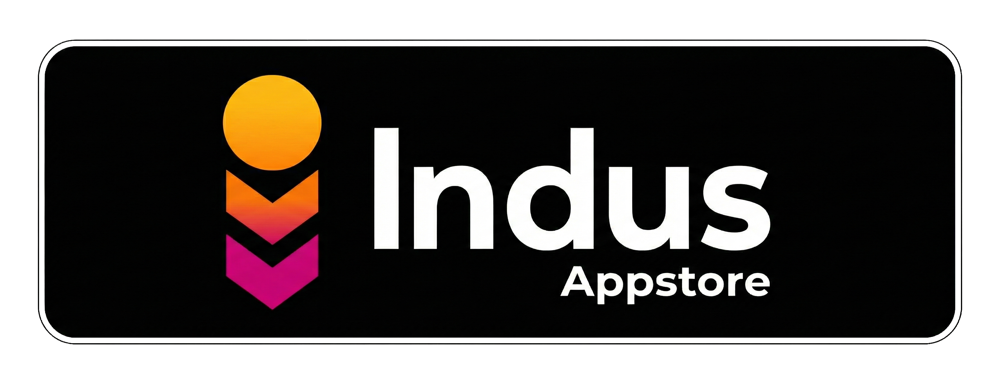

  

<h1 align="center">Thor App Manager</h1>

  
  &nbsp;
  
  &nbsp;
  

  <a href="https://t.me/thorAppDev">Telegram Channel</a>

---

* Kotlin, Jetpack Compose, and Material 3
* Room-backed app cache and custom hidden API bypass
* Free software under GPL-3.0-or-later, with no ads or trackers
* FOSS APK on [GitHub Releases](https://github.com/trinadhthatakula/Thor/releases); the FOSS build is reproducible
* The FOSS app uses the network for the optional Extension Manager; the Store build also connects to Google Play Billing

## Working Features

### Apps and installation

- Room-cached app lists with search, sorting, source and permission filters, split/frozen/suspended/hidden indicators, a scroll-position indicator, and a saved list or grid layout. Export the current list to CSV.
- App Info quick actions can be reordered or hidden. Tap an app icon to launch it, or long-press it for Android's app settings.
- Install APK, APKM, APKS, and XAPK packages (including supported OBB expansion assets) through Root, Shizuku, Dhizuku, or Android's installer. Eligible Root/Shizuku installs of older-target APKs require explicit consent unless the separate saved override is enabled; install-time runtime-permission grants are opt-in.
- Per-app permission management can grant or revoke supported runtime permissions. App Ops beyond those controls are not a general-purpose editor.
- Per-component control can open activities, stop running services, and disable, enable, or reset activities, services, receivers, and providers. Thor records its own disables for **Restore all** across apps for the current Android user. Component changes and forced launches require Root or Shizuku running as root; ordinary exported activities can open without privilege.
- Clear app data through Root, Shizuku, or Dhizuku; clear one app's cache with Root, or clear caches across the device with Root or Shizuku. Background restriction and system-app uninstall are also available where the active privilege mode supports them.
- **Fix Store** and Play installer attribution for eligible reinstall actions require Root or Shizuku. Dhizuku uses device-owner APIs for ordinary APK replacement, app removal, data clearing, suspension, and hide/unhide; it does not support Fix Store, force-stop, or whole-device cache clearing.

### Freezer and bulk actions

- Root and Shizuku freeze by disabling; Dhizuku uses Android's device-owner hide/unhide API. These paths retain the APK and app data. Thor also helps recover system apps removed for the current user by older versions.
- Universal Android Debloater recommendations label system apps. Thor blocks **Unsafe** freeze targets and warns for **Expert** targets to reduce the risk of boot problems.
- Freeze Profiles group apps for freeze/unfreeze, suspend, or force-stop actions. Assign selected apps to existing profiles from the App list or Freezer; App Info shows membership, and removing the last profile membership of a frozen app offers a recovery choice.
- Batch reinstall, uninstall, freeze, unfreeze, force-stop, suspend, unsuspend, cache clearing, sharing, and APK/bundle export. Bulk Freeze asks whether successfully frozen apps should also be added to the Freezer list. **Batch clear data and batch install are not available.**

### Backup, sharing, and Guardians

- The **Backup & Restore Hub** finds APK/APKS/XAPK bundles and encrypted `.thorbak` archives, and lets you start backups, inspect, search, share, restore, or delete them. Restores authenticate archive contents before applying them. Root can back up and restore private app data; non-root Shizuku is limited to APKs and accessible shared storage. Backup passphrases cannot be recovered.
- Export one app as APK/APKS/XAPK, export selected apps as installer bundles, share a single app, or prepare selected apps for sharing. Multi-app **Export** writes bundles; it is not bulk private app-data backup.
- **Guardians** runs supported background work through two Room-backed foreground-service queues: a data queue for archive backup/restore, single-app export, and bulk-share preparation; and a privilege queue for supported freeze/unfreeze, suspend/unsuspend, per-app cache, and eligible Fix Store/reinstall actions. Each queue processes its own tasks in order.
- The Guardians screen shows Running, Queued, and Recent tasks, with progress, logs, per-app results, and explicit cancellation. Groot, Rocket, and Star-Lord label the Root, Shizuku, and Dhizuku providers; these labels do not prove a provider is currently available. Accepted tasks can continue when the screen is dismissed; task history and recovery state remain visible after interruption. Completion after every reboot, force-stop, or lost privilege is not guaranteed. Single-app quick sharing and multi-app bundle export use separate direct paths.

### Interface and personalization

- Adaptive Home, Settings, App list, and detail layouts for phones, tablets, and foldables, including a navigation rail and landscape detail panes.
- Material 3 themes (dark, light, system, AMOLED, and Asgardian), optional dynamic colors, and [font presets](docs/font-presets.md) that apply across Thor and its external installer.
- Customize App Info actions and, separately, the App list and Freezer multi-app action toolbars. Reorder, hide, or restore their actions.
- Biometric lock for Thor, with screenshot/recording protection and a hidden Recents preview while locked.
- Eight app languages: English, Spanish, French, Arabic, Simplified Chinese, European Portuguese, Brazilian Portuguese, and Polish, with an in-app language switcher.
- Work Mode selection between available Root, Shizuku, and Dhizuku providers. The Extension Manager offers an optional catalog of add-ons, with a pinned-signer check for every downloaded APK and a SHA-256 comparison when the catalog provides a digest, both before installation.

## Upcoming Features

- Editing Packages.xml
- Batch Install
- Launcher-shortcut / deep-link triggering for automation extensions, via an authenticated handoff
  (explicit-component intent or nonce-signed token). The earlier public `thor://extension/trigger`
  deep link was removed because, being exported, any app could drive triggers through Thor's
  signature-level permission.
- Many more

## 💖 Support Development

Thor is a labor of love, built to be **ad-free and tracker-free**. If this tool has
made your Android management easier, consider supporting its continued development. Your
contributions help keep the project alive and free for everyone. Thor also offers optional support
shortcuts after some successful actions.

| Platform            | Link                                                        |
|---------------------|-------------------------------------------------------------|
| **GitHub Sponsors** | [Sponsor on GitHub](https://github.com/sponsors/trinadhthatakula) |
| **Patreon**         | [Support on Patreon](https://www.patreon.com/trinadh)       |
| **Ko-fi**           | [Support on Ko-fi](https://ko-fi.com/trinadh)               |
| **Buy Me a Coffee** | [Buy me a coffee](https://www.buymeacoffee.com/trinadh)     |
| **PayPal**          | [Donate via PayPal](https://www.paypal.me/trinadhthatakula) |

## Credits

- Built the **Odin** root-service binding framework, now a standalone library at
  [`trinadhthatakula/Odin`](https://github.com/trinadhthatakula/Odin) and published to Maven
  Central as `com.trinadhthatakula:odin`. Odin was adapted from the architectural design of
  [`libsu`](https://github.com/topjohnwu/libsu) by [topjohnwu](https://github.com/topjohnwu/) and
  completely rewritten to eliminate all `com.topjohnwu` package namespaces.
- Replaced [`AndroidHiddenApiBypass`](https://github.com/LSPosed/AndroidHiddenApiBypass) with an
  internal Kotlin implementation in the
  [`bypass`](https://github.com/trinadhthatakula/Thor/tree/master/bypass) module, backed by Java
  stubs in the [`vm-runtime`](https://github.com/trinadhthatakula/Thor/tree/master/vm-runtime)
  module for maximum compatibility when shadowing system classes.

### Architectural Advances in Odin

- **Pure Kotlin**: Fully converted the original Java-based design of `libsu` into a high-performance, modern, reactive Kotlin library.
- **Zero Raw Binaries**: Completely eliminated precompiled binary dependencies (such as `main.jar`), bypassing external file extractions.
- **Direct APK Classpath Invocations**: Dynamically mounts the app's main APK (`base.apk`) on `app_process`'s execution `CLASSPATH`, bootstrapping directly using a custom Kotlin classloader trampoline (`com.valhalla.superuser.internal.RootServerMain`).
- Refer to the [Odin README](https://github.com/trinadhthatakula/Odin#readme) for more details.

## License

**Copyright © 2025–2026 Trinadh Thatakula.**

Thor is free software: you can redistribute it and/or modify it under the terms of the **GNU
General Public License as published by the Free Software Foundation — either version 3 of the
License, or (at your option) any later version** (`GPL-3.0-or-later`). See the [LICENSE](LICENSE)
file for the full text.

- The project as a whole is distributed under the GNU General Public License v3.0 or later.
- Portions derive from [`libsu`](https://github.com/topjohnwu/libsu) (Apache-2.0); all such use
  complies with the Apache-2.0 requirements.
- The **Thor name, logo, and icon are trademarks** of Trinadh Thatakula and are **not** licensed
  under the GPL. See [TRADEMARK.md](TRADEMARK.md).

### ⚠️ Official builds & unofficial forks

Thor's source is licensed under GPL-3.0-or-later, and official builds have no ads or trackers.
The FOSS APK excludes Google Play Billing; the Play build includes it for optional support.
Official builds come **only** from
[Google Play](https://play.google.com/store/apps/details?id=com.valhalla.thor),
[IzzyOnDroid](https://apt.izzysoft.de/fdroid/index/apk/com.valhalla.thor),
[Indus App Store](https://www.indusappstore.com/apps/productivity/thor/com.valhalla.thor/), and
[GitHub Releases](https://github.com/trinadhthatakula/Thor/releases).

The GPL guarantees your right to fork and modify Thor. However, an unofficial build that **injects
ads or trackers, or bundles a proprietary ad SDK** (e.g. AdMob) is **not** the official Thor, is
not endorsed, and — because it combines GPL-licensed code with proprietary components — is likely
in violation of the GPL. Such builds must also **rename the app and change the icon** per
[TRADEMARK.md](TRADEMARK.md). Please report them.
