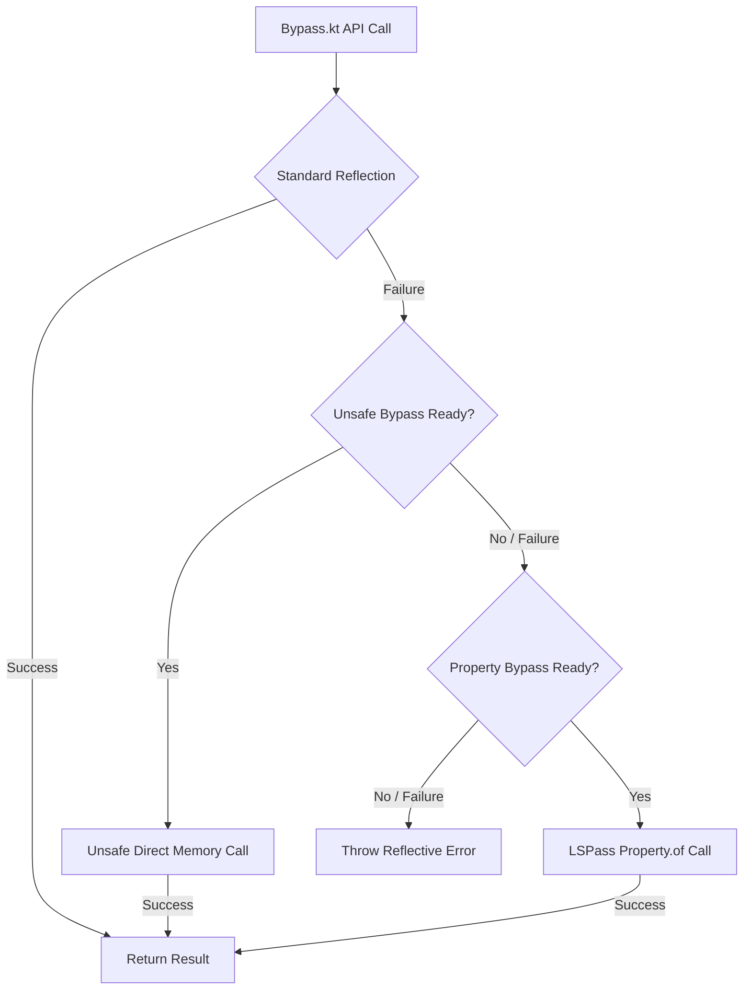

# Thor Hidden API Bypass Update & Architecture Guide

This document serves as the permanent technical anchor and maintenance roadmap for Thor's `:bypass` and `:vm-runtime` modules. It details how the runtime bypass works, how the compile-time shadowing replaces build-time bytecode manipulation, and how to verify and pull upstream updates in the future.

---

## 1. Architectural Design Overview

Thor's Hidden API Bypass allows the app to access restricted Android system and platform APIs at runtime on Android 9+ (API 28 to 37+). It implements a multi-layered, resilient, and self-healing bypass architecture.



### Bypass Layer 1: Unsafe-based Bypass (Primary / High Reliability)
- **Mechanics**: Obtains `sun.misc.Unsafe` and dynamically discovers the layout of C++ structures (`ArtMethod`, `ArtField`) in the active ART runtime at runtime.
- **Offset Scanning**: Parses the active device's `classes.dex` of the boot classpath (`core-oj.jar`) at runtime via `DexFieldLayout` and `CoreOjClassLoader` to calculate exact member offsets (`artMethod`, `methods`, `iFields`, etc.) across varying ART versions.
- **On-disk Cache**: To prevent reading and parsing DEX structures on every startup (which involves file I/O), computed offsets are serialized into `cacheDir/HiddenApiBypass`. Cache validity is guaranteed by verifying `Build.FINGERPRINT` and APEX `com.android.art` package version codes (retrieved via package manager or `/proc/self/mountinfo`).

### Bypass Layer 2: Property-based Bypass (LSPass / Fast Path)
- **Mechanics**: Uses the system's `android.util.Property.of(Class.class, Method[].class, "DeclaredMethods")` to bypass access checks without relying on `Unsafe`.
- **Characteristics**: Fast, lightweight, zero file I/O, but fragile and easier for Google to block in future security releases.

### Self-Healing Reflection Helpers
`Bypass.kt` exposes premium helper methods (`invoke`, `newInstance`, `getField`) that automate hierarchy traversal (searching parent classes and interfaces). They attempt the standard high-speed reflection path first, seamlessly falling back to `Unsafe` or `LSPass` memory patching only if restrictions are encountered.

---

## 2. Compile-Time Shadowing vs Build-Time Instrumentation

The upstream LSPosed repository relies on a custom Gradle plugin (`ClassVisitorFactory` / `AsmClassVisitorFactory`) that performs **ASM bytecode manipulation** during build time. This rewrites compiled imports starting with `stub/` (e.g. `stub.sun.misc.Unsafe` -> `sun.misc.Unsafe`).

Thor avoids this Gradle-time complexity by using **Compile-Time Shadowing**:

1. **Pure Java Stubs**: The `:vm-runtime` module is a pure Java library containing the exact classes `sun.misc.Unsafe` and `dalvik.system.VMRuntime` in their native system package names.
2. **Compile-Only Configuration**: `:bypass` includes this module using:
   ```gradle
   compileOnly(project(":vm-runtime"))
   ```
3. **Compilation**: The Kotlin/Java compiler compiles `:bypass` successfully since the stubs provide the required symbol signatures.
4. **Stripping**: Because of `compileOnly`, the stubs in `:vm-runtime` are **never** packaged into the final output APK. At runtime, the class loader of the device resolves these references to the actual system classes in the boot classpath.

This guarantees a lightweight build, zero compilation overhead, and full compatibility with standard Android build environments.

---

## 3. How to Update from Upstream

When LSPosed publishes updates to [AndroidHiddenApiBypass](https://github.com/LSPosed/AndroidHiddenApiBypass), follow these steps to integrate changes:

### Step 1: Check for Core structural changes
Review any commits modifying:
- `HiddenApiBypass.java`
- `DexFieldLayout.java`
- `Helper.java`

Pay attention to:
1. **DEX fields structure changes** (e.g., if Google modifies fields inside `Class`, `Executable`, or `MethodHandle` in future Android previews).
2. **New static/dynamic structures** inside `NeverCall` to compute ART bias/size.

### Step 2: Update stubs in `:vm-runtime`
If the upstream stubs add new native signatures or structures to `Unsafe` or `VMRuntime`, simply mirror them inside `vm-runtime/src/main/java/sun/misc/Unsafe.java` or `vm-runtime/src/main/java/dalvik/system/VMRuntime.java`.

### Step 3: Align `Bypass.kt` & Support Classes
Update `Bypass.kt`, `Helper.kt`, or `DexFieldLayout.kt` keeping them:
- **Kotlin-First**: Avoid raw Java unless layout exactness requires it (though `@JvmField` in `Helper.kt` satisfies this).
- **Self-Healing**: Ensure that reflection helpers continue to prioritize high-speed standard reflection and fallback gracefully.
- **Truncated**: Do not import tests, redundant build scripts, or signing configurations.

---

## 4. Verification & Testing

To verify compilation and stripping correctness, run:
```bash
./gradlew :bypass:assembleRelease
```

To ensure `compileOnly` stubs have been successfully stripped, you can list the class names inside the compiled `:bypass` AAR:
```bash
zipinfo -1 bypass/build/outputs/aar/bypass-release.aar | grep classes.jar
```
Ensure there are absolutely no classes matching package `sun.misc.*` or `dalvik.system.*` compiled inside `classes.jar`.
