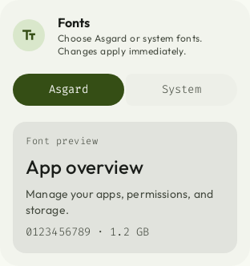
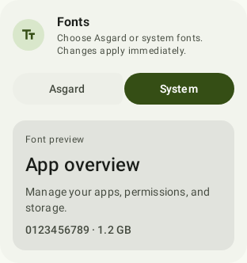

# Font presets

Open **Settings → Customization → Fonts** to choose how text looks throughout Thor and its
external installer. The choice applies immediately and is saved for the next launch.

- **Asgard** keeps Thor's existing Outfit headings and body text, with Fira Code labels.
  It is the default for new and existing installations.
- **System** uses Android's default UI font for headings, body text, buttons, and labels.
  Its appearance depends on the fonts supplied by the device.

Technical text, such as logs and package identifiers, stays fixed-width: Fira Code in Asgard,
Android's monospace family in System. Both presets keep the same sizes, weights, and spacing,
and respect the device's text-size setting.

The preview shows heading, body, and label samples. These images were rendered by the local
JVM UI tests; they do not establish how an OEM's custom system font will render on a device.

| Asgard | System |
| --- | --- |
|  |  |
