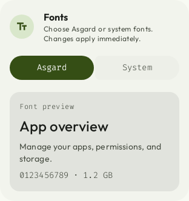
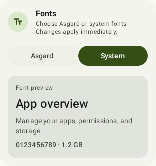

# Font presets

Open **Settings → Customization → Fonts** to choose how text looks throughout Thor and its
external installer. The choice applies immediately and is saved for the next launch.

- **Asgard** keeps Thor's existing Outfit headings and body text, with Fira Code labels.
  It is the default for new and existing installations.
- **System** uses Android's default UI font for headings, body text, buttons, and labels.
  Its appearance depends on the fonts supplied by the device.

Technical text, such as logs and package identifiers, stays fixed-width: Fira Code in Asgard,
Android's monospace family in System. Both presets keep the same sizes, weights, and spacing,
and respect the device's text-size setting.

The preview shows heading, body, and label samples. These images were rendered by the local
JVM UI tests; they do not establish how an OEM's custom system font will render on a device.

| Asgard | System |
| --- | --- |
|  |  |

## Bundled Outfit font

Outfit uses one bundled variable font, with a `wght` axis spanning 100–900. In
[`Type.kt`](../app/src/main/java/com/valhalla/thor/presentation/theme/Type.kt), every weight from
Thin through Black declares both its matching `FontWeight` and an explicit
`FontVariation.Settings(FontVariation.weight(...))`. Matching metadata alone does not select
the variable axis; this file defaults to weight 100, including when requested as Regular without
an explicit axis. Keep both declarations together when changing the family.

The private `AndroidFont` loader constructs each native typeface directly with `Typeface.Builder`,
setting its weight and `wght` axis before building. These builder APIs are available from API 26,
below Thor's minimum supported API 28.
It avoids the resource-loader path that applies axes to a `Paint` and then returns its typeface:
on the tested POCO/HyperOS device, the `Paint` draws the right weight but its returned `Typeface`
loses the variation. Both declarations and real rendering are therefore covered by the device tests.
Compose still selects the weight for accessibility preferences; the loader applies the selected
weight without a second adjustment.

The font has no italic/slant axis. Italic requests retain Thor's existing upright aliases at each
weight. Fira Code, preset roles, and typography sizes/spacing are unchanged.

- Asset: `app/src/main/assets/fonts/outfit_variable.ttf`, unmodified Outfit Version 1.100.
- Pinned source: [Google Fonts, commit 8b0a1d0f](https://raw.githubusercontent.com/google/fonts/8b0a1d0f5983c89bc2b93f1b5fb55f9e252744b5/ofl/outfit/Outfit%5Bwght%5D.ttf).
- SHA-256: `fc7287273e66929776e2ba54f144fe699080bec29f61bf649d70d871468aeade`.
- Copyright and SIL OFL 1.1: [`outfit-OFL.txt`](../app/src/main/assets/licenses/outfit-OFL.txt),
  also bundled in the APK.

`OutfitVariableFontTest` renders all nine production weights with synthetic bold disabled,
checks distinct outlines and increasing ink coverage, and exercises Normal/Italic at font scales
1.0 and 1.3. It writes PNG specimens and CSV metrics to the debug app's internal files directory
under `outfit-font-validation/` for before/after device comparisons.

See the [variable-font validation report](validation/outfit-variable-font.md) for device results,
before/after specimens, and measured APK sizes.
