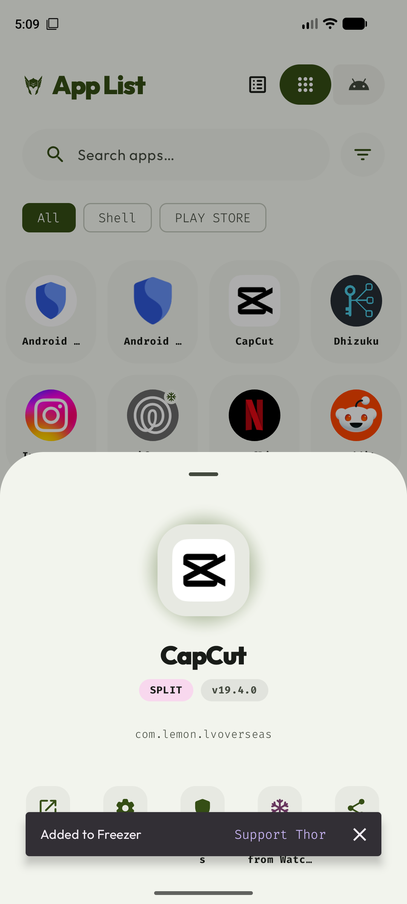
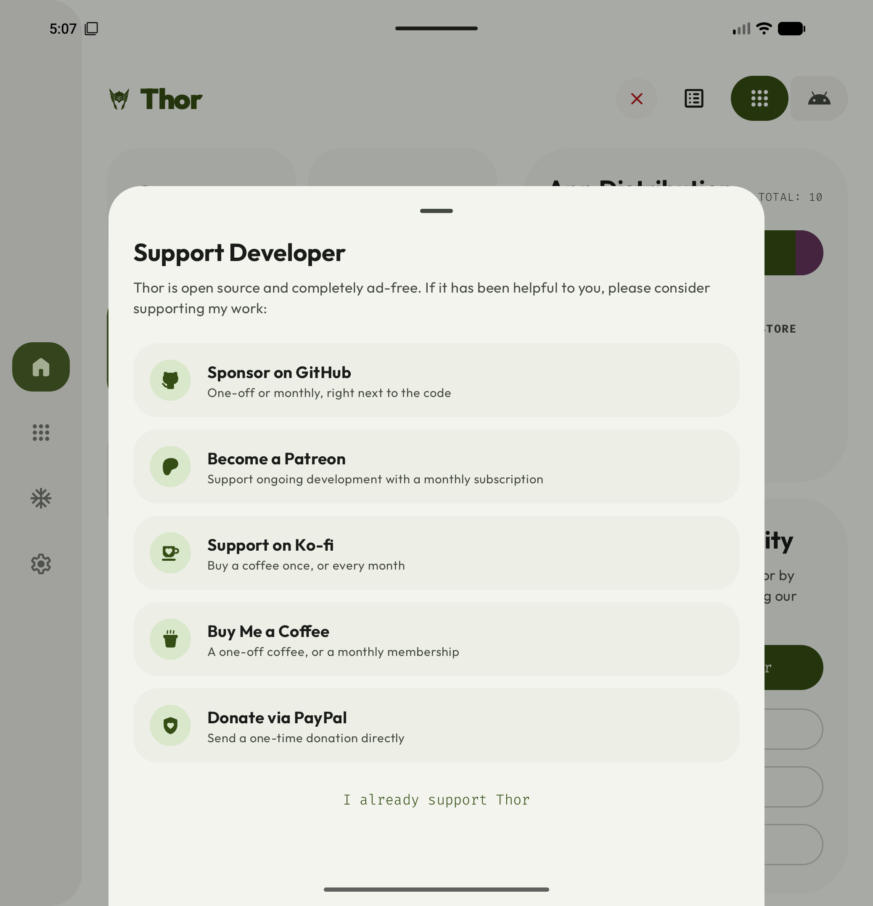

# Support invitations

Thor keeps its existing, local once-only automatic support introduction after a successful
operation. The existing `has_shown_support_developer_prompt` preference is preserved. Opening
the support sheet deliberately also counts as seeing the introduction.

Further invitations are voluntary **Support Thor** buttons on fresh successful results:

- Main action snackbars and completed terminal loggers.
- Direct app, freezer, and component action feedback.
- Installer results, completed queue tasks, and backup/restore/cache results.

Support stays secondary to Close/Open and to recovery or undo actions. New feedback replaces
older success snackbars. A support tap on a completed modal replaces the result with the support
sheet. Failed, partial, cancelled, warning-bearing, and historical results do not earn a button.
The existing automatic introduction waits until a main logger/result sheet is dismissed.

## Eligibility

FOSS can invite once preferences are loaded. Store can invite only when Play Billing is connected
and its purchase query confirms no subscription. Loading, failed/unknown purchase queries,
pending purchases, and existing subscribers suppress both automatic and contextual invitations.
Successful operations observe this state; they do not trigger extra billing queries. Lifecycle
purchase refresh and purchase acknowledgement continue to run.

**I already support Thor** is available in FOSS and in Store when the billing connection is
unavailable. It is hidden while Store is connecting or connected. Selecting it saves a local
preference that suppresses future invitations, including after billing reconnects. Opening a
donation link alone never marks someone as a supporter.

Home and Settings keep their deliberate support entry points for everyone, including subscribers.
Support preferences are local app settings, as before; they are not an account-wide history.

## Examples

Success feedback stays accessible inside an open app-info sheet:

FOSS supporters can opt out of future invitations:

