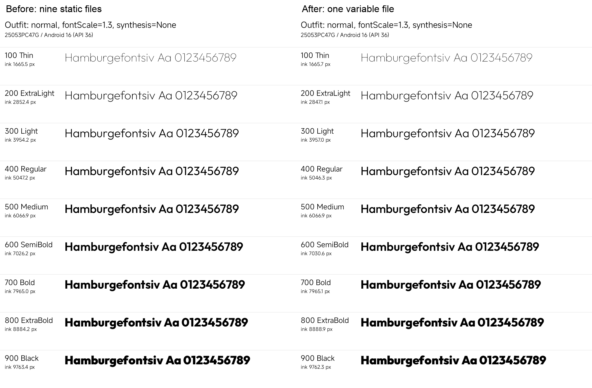
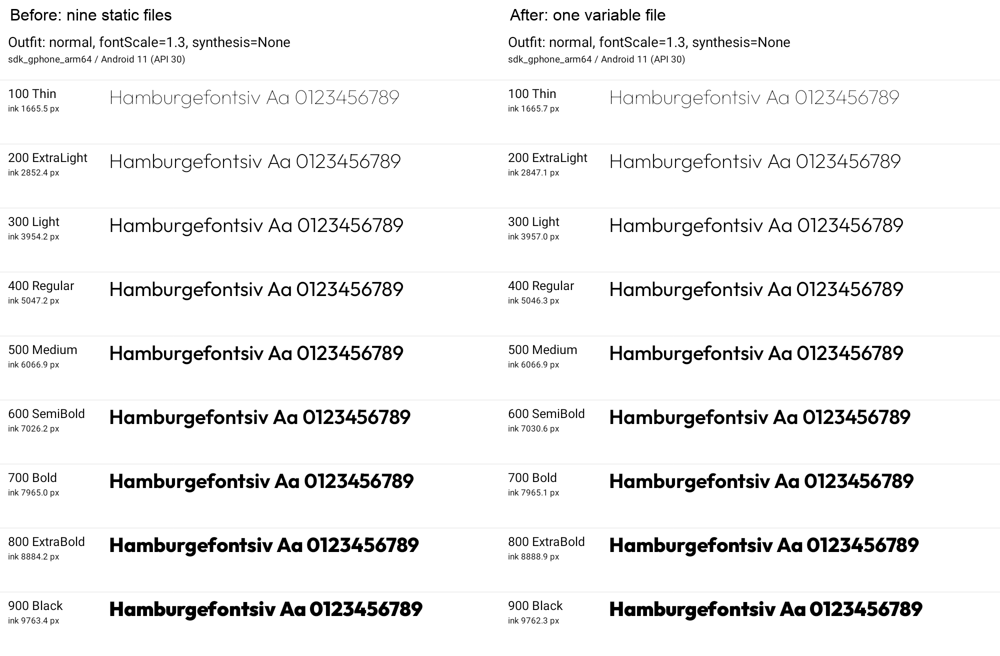

# Outfit variable font validation

Validated 2026-10-04 on `chore/outfit-variable-font`, branched from `dev`.
Frozen static-font baseline: `aac17127b9f5a497b1c27a0c761e6b9cb11b37c2` (PR #555 merge).
Version remains **1.97.0 / 1970**. Any PR targets `dev`.

## Change and source

Nine static Outfit TTFs are replaced by one unmodified **110,884-byte** variable asset:
`app/src/main/assets/fonts/outfit_variable.ttf`. Its only axis is `wght` 100–900,
with nine named instances and a default of 100. Regular therefore needs an explicit axis too.

- Upstream: [Google Fonts Outfit, pinned source](https://raw.githubusercontent.com/google/fonts/8b0a1d0f5983c89bc2b93f1b5fb55f9e252744b5/ofl/outfit/Outfit%5Bwght%5D.ttf).
- Source commit: `8b0a1d0f5983c89bc2b93f1b5fb55f9e252744b5`; Outfit Version 1.100.
- SHA-256: `fc7287273e66929776e2ba54f144fe699080bec29f61bf649d70d871468aeade`.
- Copyright and full SIL OFL 1.1: `app/src/main/assets/licenses/outfit-OFL.txt`, bundled in the APK.

[`Type.kt`](../../app/src/main/java/com/valhalla/thor/presentation/theme/Type.kt) declares all nine
weights, Thin through Black, for both Normal and Italic requests. The font has no italic/slant
axis: Italic continues to select the corresponding upright outline, as with the static fonts.
Matching weight metadata and explicit variation settings remain paired. Fira Code, font preset
roles, typography sizes, line heights, and spacing are unchanged. Web font assets are unchanged;
[their reproduction instructions](../../web/src/fonts/README.md) retain the pinned static sources.

## Why the loader uses Typeface.Builder

The initial Compose `ResourceFont` implementation declared every weight and axis correctly and
passed on both emulators, but all nine weights collapsed on the POCO/HyperOS phone. Metadata
inspection alone would have missed this failure.

Platform diagnostics rendered nine distinct weights directly through a `Paint` with its axis set,
but rendering with the `Typeface` returned by that `Paint` produced only one distinct outline.
A fresh `Paint` did not fix it. Building the variation directly with `Typeface.Builder` produced
nine distinct outlines. The final private `AndroidFont` loader therefore sets both the native
weight and `wght` axis before building the typeface, with `setItalic(false)` for the upright aliases.
Compose's custom-font path returns this typeface without applying its resource loader's Paint step.

The builder APIs exist since API 26, below Thor's minimum API 28. Weight/style value equality
keeps Compose's cache entries distinct. Accessibility weight adjustment occurs before font
selection in Compose; the loader does not apply it a second time.

## Device results

The same five tests ran against the static baseline and final variable candidate:
three `OutfitVariableFontTest` checks and two `FontPresetRenderingTest` checks.

| Target | Baseline | Candidate |
| --- | --- | --- |
| POCO F7 / `25053PC47G`, ReSuKiSU, Android 16/API 36 (`1da5425f`) | **5/5 passed** | **5/5 passed** |
| `Odin_Magisk_API36_1`, Magisk, Android 16/API 36 (`emulator-5582`) | **5/5 passed** | **5/5 passed** |
| `Thor_Issue522_API30`, Android 11/API 30 (`emulator-5584`) | **5/5 passed** | **5/5 passed** |

Each target provides **36 before/after specimen pairs**: nine weights × Normal/Italic × font
scales 1.0/1.3. Every style/scale group has nine distinct alpha rasters and increasing ink coverage.
`FontSynthesis.None` prevents fake bold from concealing a collapsed weight. Tests also verify
upright Italic aliases, larger text at scale 1.3, and absence of clipping. Scale and accessibility
overrides use isolated test contexts; they do not change device settings.

Across all 108 specimen pairs, width, height, and first-baseline deltas are **zero**. The largest
absolute ink-coverage difference is **0.211501%** (less than 0.212%). Pixel identity is not required:
the variable/static outline audit permits tiny rounding differences while retaining geometry.

The production font picker and installer dialog tests verify Asgard/System switching and role
selection, stable typography metrics, and waiting for saved installer preferences. Actual Home
and external installer preview screens were also visually checked on all three targets. The
preview was cancelled before confirmation; no target APK was installed through it. Validation
installed only debug app/test APKs and required no `adb root`, new root grants, device-setting
changes, or replacement of the daily-use release app and its data.

| POCO F7 before/after | Android 11 before/after |
| --- | --- |
|  |  |

## Font audit and host verification

The fontTools **4.63.0** audit compares the variable font at each weight with the frozen static
sources. Unicode coverage increases from **340 to 360 codepoints**, with no losses. Actual glyph
counts increase from **355 to 416**; codepoints and glyphs are separate counts. Shared advance
widths and vertical metrics match at every weight. Contour topology matches, with maximum outline
coordinate differences no greater than **1/1000 em**.

Toolchain: Zulu **21.0.12.1**, Gradle **9.8.0**, AGP **9.5.0-alpha08**, Kotlin **2.4.20**,
and resolved Compose UI Text **1.12.1**. Host tests completed with **3,584 tests per debug flavor**
and zero failures, errors, or skips. Debug app/test builds and the six final device test runs passed.
The complete `test lintFossDebug lintStoreRelease :app:assembleFossRelease :app:assembleStoreRelease`
gate passed. FOSS Debug lint has 9 hints and Store Release lint has 8 hints, with **zero errors or
warnings**, including no MissingTranslation or SyntheticAccessor findings. Two test-only UseKtx
findings were corrected before this final gate and device rerun. `git diff --check` also passed.

## Measured release APK sizes

Both versions use the same toolchain and build configuration. These are complete **unsigned APK**
measurements, including the custom loader and bundled Outfit license; signing overhead is excluded.

| Flavor | Static baseline, bytes | Variable candidate, bytes | Saved bytes | Reduction |
| --- | ---: | ---: | ---: | ---: |
| FOSS | 4,966,161 | 4,808,071 | **158,090** | **3.18%** |
| Store | 5,172,962 | 5,031,260 | **141,702** | **2.74%** |

Each candidate contains exactly two TTF entries: Outfit at `assets/fonts/outfit_variable.ttf`
and the unchanged Fira Code resource. Outfit occupies **56,155 compressed bytes**, compared with
**215,041 bytes** for the old nine files. The full Outfit license adds **1,943 compressed bytes**.
No static Outfit font remains in either APK. Complete-APK savings differ between flavors because
ZIP alignment/overhead and other packaging bytes also change; font-payload savings alone are not
the final APK reduction.

SHA-256:

```text
Baseline FOSS   5fbd87e6bcb790a5074d5b2f325ddb12b417816adebbe0a1c8837747efac5de3
Candidate FOSS  c181ec43bfbc8d03bcdeb150efbe268d4b8002b084b6e3da25ccac90177b5384
Baseline Store  8fe787b62d6779886c501ae0ac1b94e93b3beaaa39e4ad9721bc95cbef1cb93c
Candidate Store fa292cd93ce807f99c43f501eb3e6fdba10c60cd9891d24bed438343dc92ccdc
```

## Reproduction and artifacts

Run from the topic worktree with JDK 21 and the Android SDK configured. Run Gradle commands
sequentially; retain baseline APKs before replacing the static production sources. For a fresh
baseline, use the frozen commit in a separate worktree with these same two Android test files.

```sh
./gradlew --max-workers=1 :app:assembleFossDebug :app:assembleFossDebugAndroidTest
./gradlew --max-workers=1 test lintFossDebug lintStoreRelease \
  :app:assembleFossRelease :app:assembleStoreRelease
```

The following uses a new evidence directory so it does not overwrite the retained acceptance run.
Replace the serial with the desired target; repeat for each target and baseline/candidate APK pair.

```sh
serial=1da5425f
evidence_dir=$(mktemp -d "${TMPDIR:-/tmp}/thor-outfit-validation.XXXXXX")
adb -s "$serial" install -r -t app/build/outputs/apk/foss/debug/app-foss-debug.apk
adb -s "$serial" install -r -t \
  app/build/outputs/apk/androidTest/foss/debug/app-foss-debug-androidTest.apk
adb -s "$serial" shell am instrument -w -r \
  -e class com.valhalla.thor.presentation.theme.OutfitVariableFontTest,com.valhalla.thor.presentation.theme.FontPresetRenderingTest \
  com.valhalla.thor.debug.test/com.valhalla.thor.ThorTestRunner \
  | tee "$evidence_dir/instrumentation.log"
adb -s "$serial" exec-out run-as com.valhalla.thor.debug \
  tar -C files -cf - outfit-font-validation > "$evidence_dir/font-evidence.tar"
tar -xf "$evidence_dir/font-evidence.tar" -C "$evidence_dir"
```

Require `OK (5 tests)` in the instrumentation result; ADB process success alone is insufficient.
`run-as` reads debug-private files without root or storage grants. Four specimen PNG/CSV pairs
hold the weight metrics and hashes; `ui/` contains picker and installer component evidence.

Retained evidence: `~/.codex/artifacts/thor-outfit-variable-font-2026-10-04/`, including
`baseline/`, `candidate/`, `tested-source.json`, `validation-summary.json`,
`apk-packaging-comparison.json`, `render-comparison.json`, `outfit-font-audit.json`, `audit_outfit.py`,
and separate `resource-loader-attempt/` and `paint-loader-attempt/` failure diagnostics.
Those unsuccessful approaches are not counted as final acceptance results.

API 28, API 31, additional OEMs, and signed/minified release UI execution were not tested.
The supported-API audit does not substitute for device validation on those platforms.
