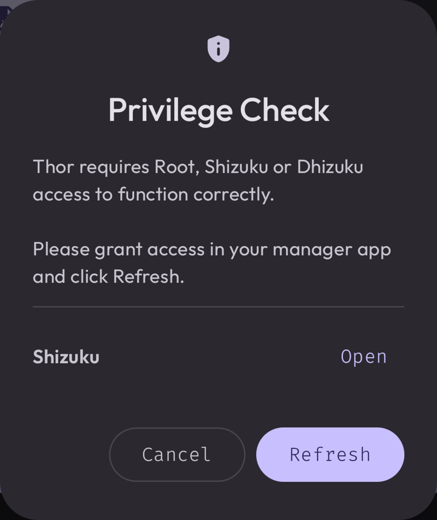
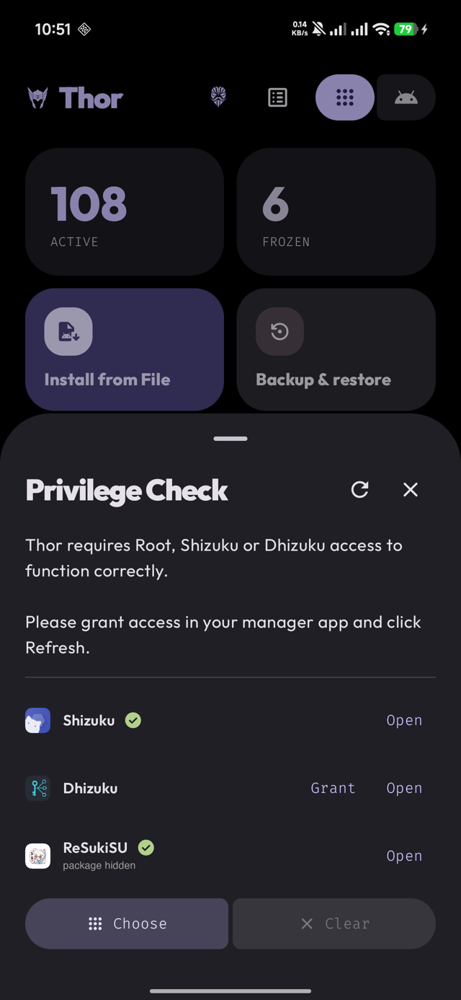
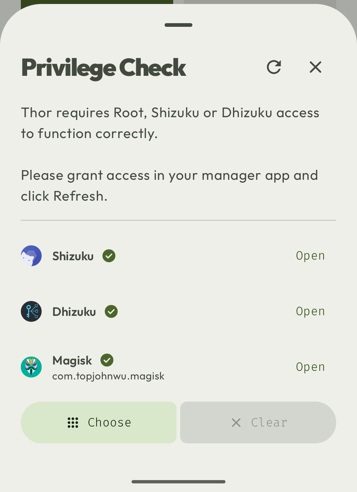
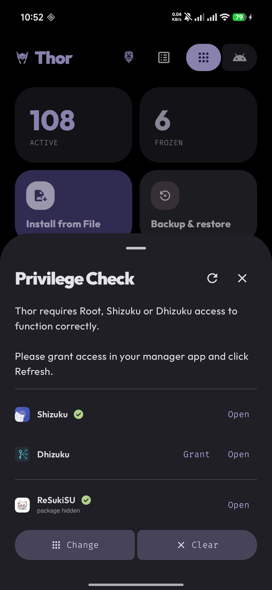
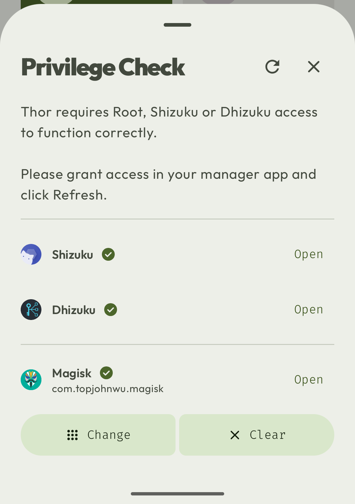

# Root manager discovery and privilege sheet validation

Validated on 2026-10-03 for [PR #553](https://github.com/trinadhthatakula/Thor/pull/553).
The tested app source is
[`fa86a8ab1eeccfe67cc44fcb3ff12d3ee10d244c`](https://github.com/trinadhthatakula/Thor/commit/fa86a8ab1eeccfe67cc44fcb3ff12d3ee10d244c),
based on dev commit `51d118b649fb03171c8de929b5608374fe1b6d29`.
Subsequent evidence commits add documentation and screenshots only.

FOSS debug APK SHA-256:
`a215e5c538f6aa11a0c290463ee9552fea4e08b0e19a86e1c6b621cb5ae77766`.
The installed APK hash matched on both devices. A build-only
`-PversionCode=1970` override allowed updating the existing test app without
removing its data; this feature does not change the repository version code.

## Local gates

Run with JDK 21 and `--max-workers=1 -PversionCode=1970`:

- [x] `./gradlew assembleFossDebug`
- [x] `./gradlew test` — 3,554 app tests in each of FOSS Debug and Store Debug;
  zero failures, errors, or skips.
- [x] `./gradlew lintFossDebug lintStoreRelease` — zero errors or warnings,
  including no MissingTranslation or SyntheticAccessor issues. The existing
  informational hints remain (9 FOSS Debug, 8 Store Release).
- [x] `git diff --check`

The feature adds 21 tests covering registry entries, canonical and renamed
launcher discovery, deduplication, disabled/removed apps, explicit shortcuts,
local preference mapping, and discovery caching. The four cache regressions
verify that unrelated preferences still emit without rediscovery, selection and
refresh changes invalidate the cache, unavailable results remain cached until
invalidation, and each collection owns a fresh cache. Each emitted preference
snapshot stays paired with the manager data for its selected package.

## Device UI checks

| Device | Root manager | Result |
| --- | --- | --- |
| POCO F7 / onyx, Android 16 (API 36) | ReSukiSU v4.2.0-rc2 (35159), randomized package ID | Checks below passed |
| Odin_Magisk_API36_1 emulator, Android 16 (API 36), 16 KB pages | Magisk 30.7 (30700) | Checks below passed; unknown-manager simulation unrun |

On both devices:

- [x] Automatic discovery shows the manager icon and package name. A green tick
  with the accessibility description **Granted** indicates live access.
- [x] Open remains available while root is granted and launches the actual
  ReSukiSU/Magisk manager.
- [x] Refresh returns to the granted tick with Open still available.
- [x] Choose opens the searchable manager sheet; selecting the manager retains
  the live grant tick and Open, and changes the selection action to Change.
- [x] Change reopens the picker, and its Close icon returns to Privilege Check.

The physical-device checks also confirmed that the selection survives a process
restart, Shizuku displays its own granted tick and Open, and search/results remain
visible with the keyboard open. On the emulator, selecting Magisk keeps one
deduplicated row, and Clear restores automatic detection and Choose with Clear
disabled. The phone was left on its selected-manager sheet; the emulator was left
on automatic Magisk with no saved selection.

The emulator screenshots were refreshed after Shizuku and Dhizuku were added.
An explicit Refresh showed all three managers with their own Granted tick and
Open action. Both automatic discovery and a selected Magisk shortcut were
captured, and the installed APK hash still matched `fa86a8ab`. This screenshot
refresh did not rerun Shizuku/Dhizuku authorization or manager-launch flows.

The unknown-manager fallback was reviewed in code: it shows generic Root with
Choose and derives its tick from the same live root grant. Its device simulation
remains **unrun**. The emulator rejected launcher-component changes through
`pm` (exit 255), and its existing shell `su` access returned Permission denied
(exit 13). Read-only verification confirmed Magisk's launcher remained in its
original DEFAULT state with no component overrides and the package enabled.

These are device UI smoke checks; no instrumentation suite or root-policy toggle
was run for this UI change. Root-manager policy was unchanged throughout.

## Earlier layout coverage

Source [`34b43c2d58589a4145266b0b311d37abe2646c62`](https://github.com/trinadhthatakula/Thor/commit/34b43c2d58589a4145266b0b311d37abe2646c62),
APK SHA-256 `b82afd8a60e25492a36f703ed2443e1336078f792e0af5604212c7c156b14420`,
passed Portuguese at 2× font scale: the wrapped Choose label and single-line
Clear label shared the same button height (238 px). That source also passed
physical selection/clearing across restarts and the header Close action.
English at normal/2× font scale and docked-keyboard scrolling were checked on
preview `02b40176`. The earlier layout checks were not rerun at the latest source;
the earlier UI used detection/selection ticks. Emulator locale and font scale
were restored after those checks.

## Screenshots

Phone package IDs are redacted in the published images. The four manager
screenshots below use `fa86a8ab`; the previous dialog is retained for comparison.
Both emulator captures include Magisk, Shizuku, and Dhizuku.

| Before | ReSukiSU, detected | Magisk, Shizuku, and Dhizuku |
| --- | --- | --- |
|  |  |  |

| ReSukiSU, selected | Magisk selected, with Shizuku and Dhizuku |
| --- | --- |
|  |  |

Historical Portuguese layout at 2× text size (`34b43c2d`, before grant-only ticks):

