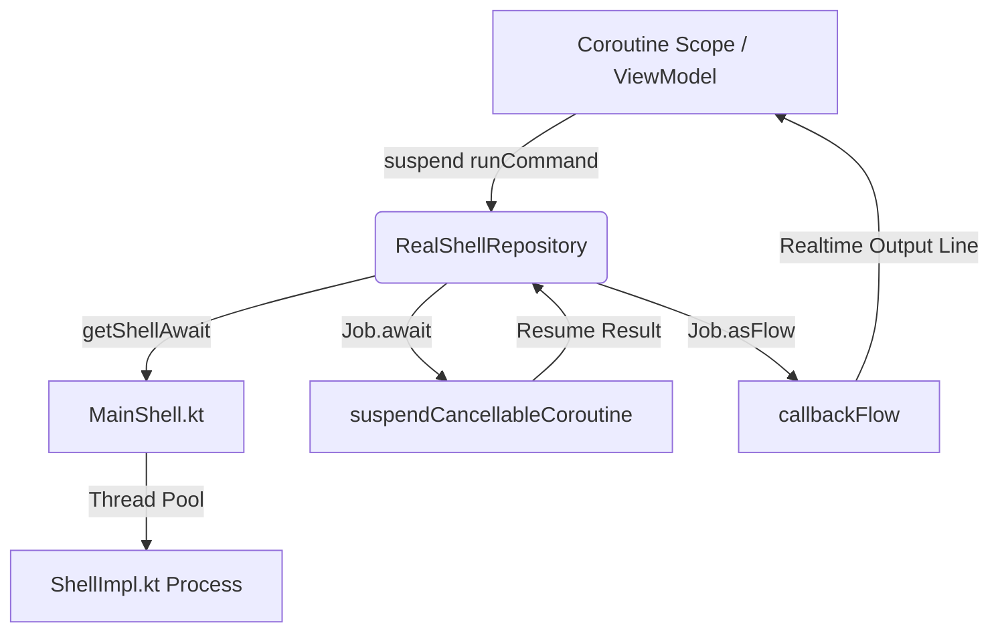

# Thor suCore Kotlin-First Architecture & Update Guide

This document serves as the permanent technical anchor, architectural reference, and future maintenance roadmap for Thor's `:suCore` module. It explains how our modern, reactive Kotlin-first Unix shell wrapper diverges from the upstream Java-based `libsu` library, evaluates additional upstream modules for future integration, and provides instructions for pulling and verifying upstream updates.

---

## 1. Architectural Design Overview

Thor's `:suCore` module provides high-speed, safe, and thread-resilient interactive Unix shells (both root and non-root). It represents a **complete, Kotlin-first modernization** of John "topjohnwu" Wu's outstanding `libsu` library.

While upstream `libsu` is heavily anchored in legacy Java patterns (such as custom `Handler` thread dispatching, custom synchronized list-callbacks, and blocking `WaitRunnable` threads), `:suCore` is redesigned from the ground up to be **reactive, coroutine-native, and safe for modern Android applications**:



### Key Reactive Kotlin Constructs in `:suCore`

1. **`Shell.Job.await()` (Coroutines Bridge)**:
   Our suspending wrapper completely eliminates the traditional `ResultCallback` callback hell:
   ```kotlin
   suspend fun Shell.Job.await(): Shell.Result = suspendCancellableCoroutine { cont ->
       submit(object : Shell.ResultCallback {
           override fun onResult(out: Shell.Result) {
               if (cont.isActive) cont.resume(out)
           }
       })
   }
   ```

2. **`Shell.Job.asFlow()` (Streaming Shell Output)**:
   Bypasses the custom synchronized `CallbackList` pattern by piping shell standard outputs directly into a modern `Flow<String>` via `callbackFlow`:
   ```kotlin
   fun Shell.Job.asFlow(): Flow<String> = callbackFlow {
       val flowList = object : java.util.ArrayList<String?>() {
           override fun add(element: String?): Boolean {
               element?.let { trySend(it) }
               return super.add(element)
           }
       }
       to(flowList)
       submit(object : Shell.ResultCallback {
           override fun onResult(out: Shell.Result) { close() }
       })
       awaitClose {}
   }
   ```

3. **`getShellAwait()` (Suspending Initialization)**:
   Suspends the calling coroutine context without blocking the underlying JVM thread during slow root-access prompts:
   ```kotlin
   suspend fun getShellAwait(): Shell = suspendCancellableCoroutine { cont ->
       Shell.getShell(object : Shell.GetShellCallback {
           override fun onShell(shell: Shell) {
               if (cont.isActive) cont.resume(shell)
           }
       })
   }
   ```

4. **`UiThreadHandler` (Coroutine-Based Thread Dispatcher)**:
   We replaced the legacy Java `Handler` + `WaitRunnable` thread-blocking locks with a streamlined coroutine dispatcher:
   - **Asynchronous Dispatching**: Uses `CoroutineScope(SupervisorJob() + Dispatchers.Main.immediate)` to execute UI callbacks.
   - **Synchronous Dispatching**: Uses a coroutine bridge `runBlocking { withContext(Dispatchers.Main) { r.run() } }` instead of raw JVM monitoring.

---

## 2. Upstream `libsu/core` vs Thor `suCore` Code Mapping

To facilitate future updates, the table below maps Java files in upstream `libsu/core` (`com.topjohnwu.superuser`) to Kotlin files in Thor's `:suCore` (`com.valhalla.superuser`):

| Upstream Java Class (`libsu/core`) | Thor Kotlin Class (`:suCore`) | Porting / Divergence Strategy |
| :--- | :--- | :--- |
| `CallbackList.java` | `CallbackList.kt` | Preserved for binary backward-compatibility, but deprecated internally in favor of `Shell.Job.asFlow()`. |
| `NoShellException.java` | `NoShellException.kt` | Ported as a standard Kotlin Exception class. |
| `Shell.java` | `Shell.kt` | Ported as a Kotlin abstract class. Removes deprecated `Shell.sh` and `Shell.su` legacy entries. |
| `ShellUtils.java` | `ShellUtils.kt` & `utils/ShellUtils.kt` | Segmented into core utility helper extensions and logging components (`utils/Logger.kt`). |
| `internal/BuilderImpl.java` | `internal/BuilderImpl.kt` | Custom builder implementation targeting Kotlin types. |
| `internal/JobTask.java` | `internal/JobTask.kt` | Translated into Kotlin. |
| `internal/MainShell.java` | `internal/MainShell.kt` | Modernized into a Kotlin thread-safe `object` singleton. |
| `internal/PendingJob.java` | `internal/PendingJob.kt` | Kotlin-first implementation of pending shell jobs. |
| `internal/ResultFuture.java` | `internal/ResultFuture.kt` | Kotlin implementation wrapping java Futures. |
| `internal/ResultHolder.java` | `internal/ResultHolder.kt` | Basic result data holder class. |
| `internal/ResultImpl.java` | `internal/ResultImpl.kt` | Standard shell job results. |
| `internal/ShellImpl.java` | `internal/ShellImpl.kt` | Implements lock-guarded, condition-signaled interactive processes. |
| `internal/ShellInputSource.java` | `internal/ShellInputSource.kt` | Basic stream pipeline writer. |
| `internal/ShellJob.java` | `internal/ShellJob.kt` | Interactive command pipeline coordinator. |
| `internal/StreamGobbler.java` | `internal/StreamGobbler.kt` | Stream parsing and redirection helper. |
| `internal/UiThreadHandler.java` | `internal/UiThreadHandler.kt` | **DIVERGED**: Completely rewritten to use Kotlin Coroutines (`Dispatchers.Main.immediate` and `runBlocking`). |
| `internal/Utils.java` | `internal/Utils.kt` | Ported helper constants and library configurations. |
| `internal/WaitRunnable.java` | **TRUNCATED** (Does not exist) | **OMITTED**: Redundant; replaced by `UiThreadHandler.runAndWait()` with `runBlocking` bridge. |
| **N/A** (Unique upstream construct) | `internal/CoroutineStreamGobbler.kt` | **EXCLUSIVE**: Supports reactive coroutine streams. |
| **N/A** (Unique upstream construct) | `ktx/ShellExtensions.kt` | **EXCLUSIVE**: Suspended bridges, flows, and asynchronous helpers. |
| **N/A** (Unique upstream construct) | `ktx/ShellRepository.kt` | **EXCLUSIVE**: High-level repository pattern for dependency injection (Koin). |
| **N/A** (Unique upstream construct) | `utils/Logger.kt` | **EXCLUSIVE**: Standardized platform logging interceptors. |

### Alignment Status with `libsu 6.0.0`
Thor's `:suCore` is already fully aligned with the latest stable release of `libsu 6.0.0` (and downstream `master` branch commits):
- **Infinite Recursion Protection**: Our `MainShell.kt` incorporates upstream commit `6c9618b` to raise a `NoShellException` if the main shell crashes during initialization, preventing infinite recursive cascades.
- **Lock-Based Task Scheduler**: Our `ShellImpl.kt` is fully upgraded with upstream task scheduling commit `9d245f0`, integrating a `ReentrantLock` and `Condition` scheduler to ensure synchronous `execTask` calls run in precise submission order and prevent thread starvation.
- **Clean Deprecations**: We have successfully removed archaic `sh()` and `su()` static methods in accordance with the `6.0.0` migration guide, routing all commands through `Shell.cmd()`.

---

## 3. Upstream Modules Feasibility Study

The upstream `libsu` repository is modularized into several components. Here is an evaluation of their utility and feasibility for integration into Thor:

### A. `:service` (`RootService`) — **HIGH FEASIBILITY & GAME-CHANGING**
- **What it is**: A premium framework to run a background service in a separate, isolated root process (`uid=0`), allowing the main app to bind to it via **Binder IPC / AIDL**.
- **How it works**: Spawns an independent Java process as root, running a standard Binder-backed Service. Standard Android AIDL interfaces are used to transact instructions directly between the processes.
- **Feasibility for Thor**: **Highly recommended**. Spawning a shell and parsing text output is slow, memory-intensive, and brittle. By implementing a custom `RootService`, Thor can execute high-speed, compile-time typed, object-oriented operations (e.g. frozen app states, database reads, directory traversal, packaging operations) natively inside a privileged JVM process, bypassing shell scripts entirely.

### B. `:nio` (Remote File System) — **HIGH FEASIBILITY**
- **What it is**: Provides remote file system structures (`ExtendedFile`, `FileSystemManager`) wrapping Binder transactions.
- **How it works**: Leverages `RootService` to mount and manage system file systems, transferring stream bytes over IPC.
- **Feasibility for Thor**: **Highly recommended**. If `:service` is added, `:nio` allows direct Java-like file operations (e.g., recursive listings, size calculations, content checks) in restricted folders (like `/data/system` or `/data/app`) with up to **2.5x - 5x higher throughput** than standard shell-based directory scanning.

### C. `:io` (`SuFile` / `SuStreams`) — **BLOCKED / DEPRECATED**
- **What it is**: Mimics standard Java `File` classes by generating underlying shell commands (`ls`, `cat`, etc.) in the background.
- **Feasibility for Thor**: **Do NOT use**. Upstream has explicitly deprecated this module in version 5.0.0 due to high overhead and potential terminal-escaping security flaws. Direct transition to `:service` + `:nio` is the official and correct path.

---

## 4. Maintenance and Future Update Roadmap

When upstream `libsu` releases a new version, follow this systematic procedure to review, port, and verify updates in `:suCore`:

### Step 1: Compare Source Files
Clone or fetch the latest upstream `libsu` repo and use git or file-diff tools to scan the `core` source directory:
```bash
diff -rq <upstream-libsu-path>/core/src/main/java/com/topjohnwu/superuser/ <thor-path>/suCore/src/main/java/com/valhalla/superuser/
```
Verify changes to the scheduling loops (`ShellImpl.java`), builder configurations (`BuilderImpl.java`), or system state management (`Utils.java` / `MainShell.java`).

### Step 2: Port Java to Kotlin
Translate any upstream changes into Kotlin, complying with these guidelines:
1. **Preserve Reactive Helpers**: Never let upstream changes overwrite or compromise the custom reactive helpers in `ktx/ShellExtensions.kt`.
2. **Reject Java Threading**: Do not port upstream `UiThreadHandler.java` or `WaitRunnable.java` adjustments. Always retain our clean, coroutine-native implementations.
3. **Use Kotlin Idioms**: Replace Java boilerplate (like synchronized blocks or standard getters/setters) with Kotlin `synchronized()` blocks, properties, or null-safe operators.

### Step 3: Verification & Compilation Test
Compile the `:suCore` module independently to ensure no syntax errors or unresolved symbols remain:
```bash
./gradlew :suCore:assembleRelease
```

### Step 4: Verify Class Output
Verify that no legacy classes (such as `WaitRunnable`) have crept in during compile time:
```bash
zipinfo -1 suCore/build/outputs/aar/suCore-release.aar | grep classes.jar
```
Ensure that the artifact compiled cleanly and fits into the active Thor app layer.
